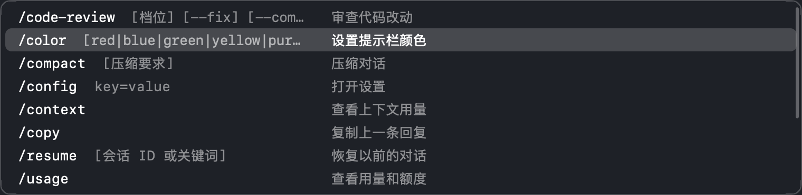
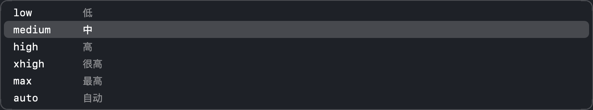

# cc-composer

在 Mac 本地写好消息，再一次性送进 [Ghostty](https://ghostty.org) 里的终端。给通过 SSH 在远程机器上用 [Claude Code](https://claude.com/claude-code) 的人准备。

SSH 延迟一高，在远程的 Claude Code 里打字就会一顿一顿的，中文输入法选字更难受；图片和文件也没法直接贴过去。cc-composer 是一个贴在 Ghostty 窗口底部的本地输入框：打字、选字、改错都在本地完成，零延迟，按回车才把整段话送进终端。图片和文件会自动经 SSH 传到远程机器，斜杠命令带中文说明和补全。



## 能做什么

- **本地输入**：在 Ghostty 里按 ⌥Space 打开，输入框贴在窗口底部，配色和字体跟着 Ghostty。↩ 发送，⇧↩ 换行，⌘↩ 只粘贴不提交；发错了 ⌘Z 找回
- **历史**：↑/↓ 翻发过的消息，规则和 Claude Code 一样（多行时先在行间移动，只记文字）
- **图片和文件**：⌘V 或拖进来。图片缩小后传到远程，发送时变成 Claude Code 里的 `[Image #N]`；其他文件原样上传，发送时把路径写在消息前面。输入框开着时，把文件拖到终端任何位置都会进输入框。点缩略图可以预览：图片放大看，其他文件用“快速查看”
- **斜杠命令**：开头打 `/` 弹出 Claude Code 的命令，带中文说明，中文也能搜（`/压缩` 能找到 `/compact`）。↑↓ 选，Tab 补全，↩ 直接发送
  - `/model`、`/effort`、`/tui` 这类有固定选项的，补全命令后接着列出选项，不用自己打
  - `/resume` 后面列出最近的会话（时间 + 标题），选一个直接恢复
  - 只打 `/` 时，用得多的命令排在前面
  - 命令表是远程的 Claude Code 自己报的，它升级或者你装了新 skill 都会自动跟上
  - 带着附件发命令时只发命令，附件留着等下一条
- **草稿**：文字和附件存在硬盘上，关掉输入框、重启应用都还在
- **不误伤**：焦点在终端时按 Esc 只收起输入框，不会中断 Claude；切到别的应用时输入框留在 Ghostty 窗口上，方便从访达拖文件



## 需要

- macOS 26 或更新
- Ghostty 1.3 或更新（用到它的 AppleScript 接口）
- 远程机器：Linux，Mac 能用 SSH 密钥免密登录；装了 Claude Code（`claude` 在 PATH 里或在 `~/.local/bin`）和 python3

在 macOS 26.6、Ghostty 1.3.1、Claude Code 2.1.285 上开发和测试。

## 安装

### 下载编译好的

到 [Releases](https://github.com/AAzzAAzzAAzzAA/cc-composer/releases) 下载 `cc-composer.zip`，解压后把 `cc-composer.app` 放进“应用程序”文件夹打开。想开机自启的话，在“系统设置 → 通用 → 登录项”里加上它。

- 只支持 Apple 芯片（M 系列），需要 macOS 26 或更新
- 没有苹果开发者签名

### 自己编译

需要 Xcode 命令行工具（没装的话运行 `xcode-select --install`）。

```sh
git clone https://github.com/AAzzAAzzAAzzAA/cc-composer.git
cd cc-composer
./build.sh --autostart   # 编译，装到 ~/Applications，启动，并设成登录后自动启动
```

### 配置远程机器

装好以后，告诉它远程机器是哪台（写你在 `~/.ssh/config` 里的主机别名，或者 `user@host`）：

```sh
mkdir -p ~/.config/cc-composer
echo "ssh_host = myvps" > ~/.config/cc-composer/config
```

第一次发送时 macOS 会问“cc-composer 想控制 Ghostty”，点允许。自己编译的话，每次重新编译后都会再问一次。

只想要本地输入、不传图片也不用命令补全的话，可以不配 `ssh_host`：文字照样能送进 Ghostty 里的任何程序。

## 配置

`~/.config/cc-composer/config`，一行一个 `key = value`，`#` 开头的是注释。改了不用重启。

| 配置 | 说明 |
|---|---|
| `ssh_host = myvps` | 远程机器的 SSH 主机名或别名。图片、文件、命令表、会话列表都靠它 |
| `remote_dir = ~/.cache/cc-composer` | 远程机器上存图片和文件的目录（这是默认值），超过 7 天的自动清理 |
| `label.my-skill = 我的 skill` | 给命令加中文说明，可以写多行。自己装的 skill 没有中文说明时用得上，也能覆盖自带的说明 |

## 按键

| 按键 | 作用 |
|---|---|
| ⌥Space | 打开 / 收起（只在 Ghostty 在前台时有效，不影响别的应用） |
| ↩ | 发送 |
| ⇧↩ 或 ⌥↩ | 换行 |
| ⌘↩ | 只粘贴进终端，不按回车 |
| ↑ / ↓ | 翻历史；命令列表开着时是选择 |
| Tab | 补全命令或参数 |
| Esc | 先关命令列表，再按一次收起输入框（草稿保留） |
| ⌘V | 粘贴文字、图片或文件 |
| ⌘Z | 撤销，发送后也能找回刚发的文字 |

## 原理

- **发送**：用 Ghostty 的 AppleScript 以粘贴的方式把文字送进当前终端，再按一下回车。图片路径单独粘贴一次，因为 Claude Code 只在整段粘贴都是图片路径时才把它们变成 `[Image #N]`
- **上传**：经 `ssh` 传到 `remote_dir`。打开输入框时先建好一条复用的 SSH 连接，贴图时不用再等握手
- **命令表**：在远程以无界面模式启动 `claude`，只做初始化握手就退出，不调用模型、不花额度、不留会话记录。缓存在本地，10 分钟刷新一次
- **会话列表**：读远程的 `~/.claude/sessions/`（正在运行的会话）和 `~/.claude/projects/`（会话记录），列出当前会话所在目录的最近 30 个

## 已知限制

- 只支持 Ghostty，界面只有中文
- 命令表、会话列表、`[Image #N]` 这些用到了 Claude Code 的内部行为，不是公开接口，它升级后可能失效；失效时会退回普通行为（比如命令列表只用自带的表）
- `/resume` 只列当前目录下的会话，因为 Claude Code 只能直接恢复当前目录的会话
- 按 Ghostty 窗口的最小化按钮时，输入框会先藏起来，免得悬在原处。按钮位置是按 Ghostty 默认标题栏量的，改了 `macos-titlebar-style` 可能对不上（只影响这一下的动画）；用 ⌘M 最小化时输入框会晚一点消失
- 远程用 Claude Code 时，建议用默认界面（`/tui default`）。全屏界面下连滚动都要经过远程，延迟高时会卡

## 排查问题

```sh
A=~/Applications/cc-composer.app/Contents/MacOS/cc-composer
$A --diagnose          # 读到的 Ghostty 配色、字体和窗口位置
$A --upload <文件>     # 走一遍上传，打印远程路径
$A --commands          # 从远程取一次命令表和会话列表，打印出来
$A --selftest          # 自检（用独立的剪贴板和临时目录，不碰你的数据）
```

草稿、历史和命令表缓存存在 `~/Library/Application Support/cc-composer/`。除了你配置的 SSH 主机，cc-composer 不连任何地方，也不收集任何数据。

## 声明

个人项目，和 Anthropic、Ghostty 都没有关系。Claude 和 Claude Code 是 Anthropic 的商标。

[MIT 许可证](LICENSE)
